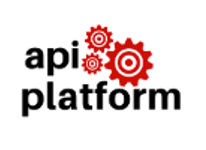
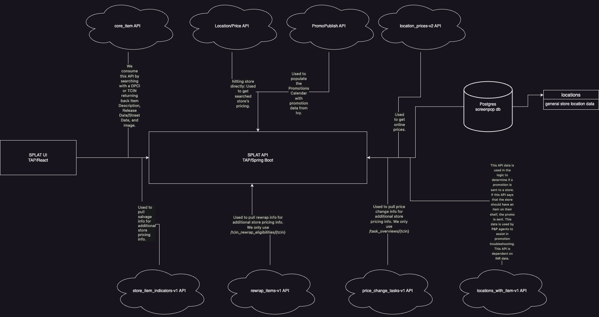
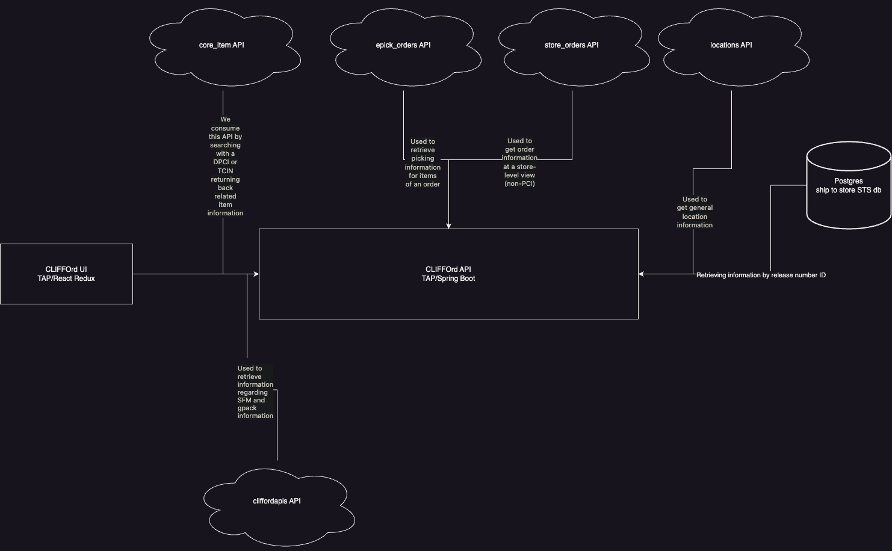
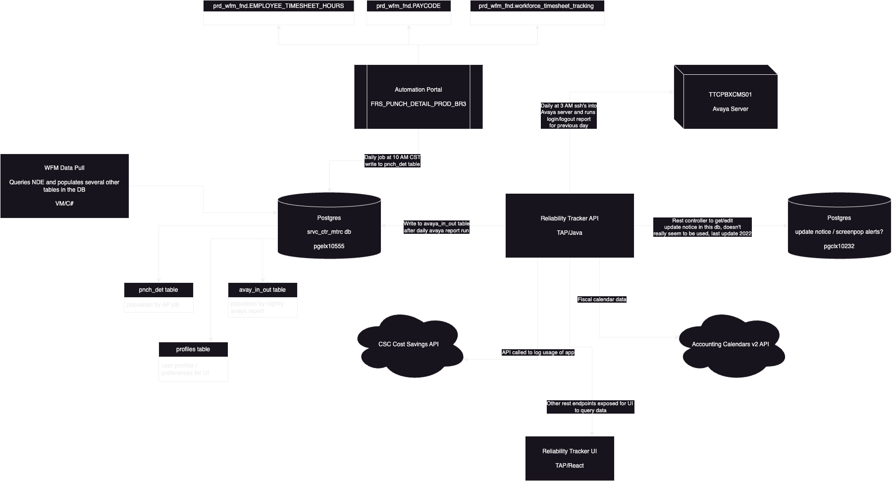
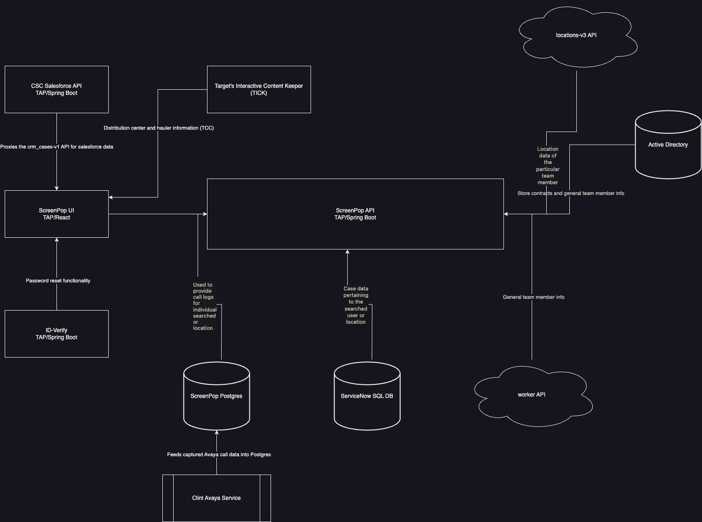
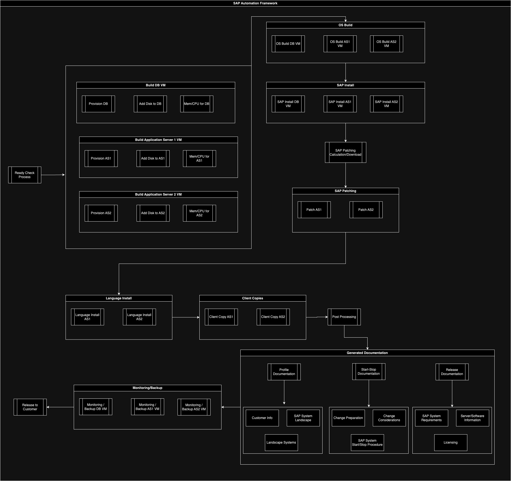
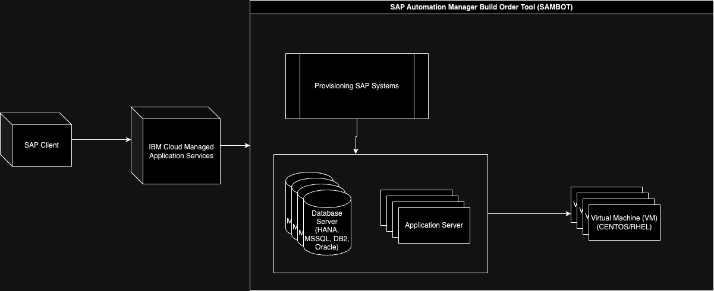
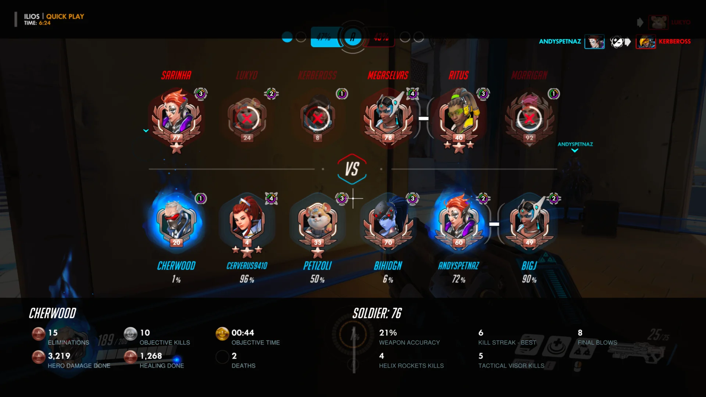
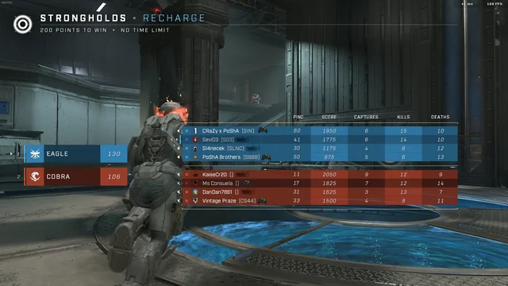

= Table of Contents
:toc:
:toclevels: 5

== About Me

I've been a software engineer with Target since that of September 2019 and have contributed in the Finance and Retail along with the Gateway Services platform spaces. I've been in the field of programming and development since graduation university in 2017, and have since strived for self-growth and enabling others' abilities as well. Throughout my time at Target I've had exposure to several technologies and different methodologies including but not limited to

[%autowidth]
|===
| Category | Technologies
| Programming languages
| Java, JavaScript, GoLang

| Frameworks
| Spring Boot, JUnit5, React/Praxis

| Infrastructure
| PostgreSQL, MongoDB, Docker, Vela, Redis, Chef, Kafka, Oracle Database

| Observability
| InfluxDB, Grafana

| Web Development
| API development, REST standards, API observability

|===

== Work

=== Target - Gateway Services (API Platform) 2022-current



_The API Platform enables partner teams to focus on their core products by providing a unified set of solutions to advance Target's API and edge compute strategy._

==== Team Wide
|===
| Timing|Feature
| March 2023
| Developed script to scan for total services hosted in our API Gateway to provide to security for appropriate auditing

| July 2023
| In association with Innovation Week, worked with a team of engineers to develop security finding alerting that can be routed into a team's slack channel

|===


==== Go-Proxy

_Go-Proxy is the proxy component of the API Platform, that provides common features such as authentication, metrics, and logging._

[%autowidth]
|===
| Timing|Feature
| May 2023
| Addressed Go-Proxy to use the new version of unilauncher due to recent SCA changes applied

|===

==== HAProxy

_HAProxy is the API Platform’s routing layer from Target's internal uniform platform to apis and non-apis. The api configurations are for APIs and have some standard logic applied. The non-api configurations are for non-APIs running in TAP that need to be exposed to the public internet._
[%autowidth]
|===
| Timing|Feature
| October 2022, February 2023
| Updated HA-Proxy and Go-Proxy PCI infrastructure to the most recent versioning of Nessus Agent Vulnerability Scan that is deployed on each of their CentOS7 servers via Chef

| May 2023
| Issued restarts for PCI HA-Proxy servers to apply automated security updates from our configured Chef recipes.

| October 2022
| Tanium system software was not functioning properly due to directories it was attempting to use that no longer are configured to do so, so then included as orphaned directories in our Chef recipe

|===

==== API Overwatch

_API Overwatch (AOW) is an in-house tool aims to offer from basic health check to complex synthetic tests to evaluate the uptime, performance and correctness of an API._

[%autowidth]
|===
|Timing|Feature
| April 2022
| Upon joining the team, API Overwatch had been dated in several areas of its architecture that needed to be updated.

| August 2022
| Worked to implement email frequency in which a user can specify in API Overwatch when they'd like to receive email summaries of their test execution results

| January-February 2023
| Several repositories of API Overwatch were missing crucial unit testing from the engineer authors no longer with Target, which working with the team I'd implement

| June 2023
| Deployed API Overwatch's enterprise vault service micro-application to the API Gateway to be called from a stores level for store engineer use

| June 2023
| Worked to replace how API Overwatch handles sending off tests to be executed, originally designed with Redis. This was changed to Kafka for better observability and equal if not better performance in terms of test execution performance

| May 2023
| Worked to mask secret information in a test to be executed

| May 2023
| Worked to mask secret information from being displayed in plain text within the user interface

| August, December 2023
| Fixed issue with how API Overwatch would validate JSON responses during test execution working with the reporting user

| February 2024
| Identified after an API Overwatch outage, manually executing tests were not functioning and were conflicting with API Overwatch's configuration with Go-Proxy, which was promptly adjusted for

| February 2024
| Due to legacy architecture and large responses from tests that couldn't be stored, it was discovered that response sizes needed to be limited and was adjusted accordingly along with working with impacted users

| February 2024
| In the UI, it was reported that there were 404 response codes when attempting to view test execution history, which was promptly adjusted and corrected

|===

=== Target - Finance and Retail Service Center Technologies 2019-2022


==== Team Wide
|===
| Timing|Feature
| November 2019
| Contributed in improving the FRS Innovations team software alerting communications interface with the addition of subjects

| September 2019-April 2022
| Made several contributions to the team's existing legacy C# and ASP.NET applications, including service center call queue boards, agent email templates, the Client Support Center site itself, as well as the Flexible Fulfillment site section for their call center agents specifically.

|===

==== Store Promo Lookup and Troubleshooting (SPLAT)
Store Promo Lookup and Troubleshooting (SPLAT) is a tool used to determine price and offers for Target items by store. Users can also view past, present, and future promotions to ensure consistency between ad and system data. SPLAT was developed out of a partnership between Innovation, CSC’s Pricing and Promo (PnP) segment, and PnP business partners.



Contributed to the development of SPLAT's API and user interface code and design decisions.

[%autowidth]
|===
| Timing|Feature
| October 2019
| Worked with the Pricing and Promotions segment of the Client Support Center in changing SPLAT's source of truth API, which led to API and UI changes that I had contributed.

| February-March 2022
| With the Items API being remodeled to that of GraphQL, remediation had to be done on SPLAT's end to which I had led development on.

|===

==== CSC's Live Information for Flexible Fulfillment Orders (CLIFFOrd)
An application that brings together data from Target’s multiple fulfillment systems to help locate and track guest orders for use in Target's internal service center order triage processes

Contributed to the development of CLIFFOrd's API and user interface code and design decisions, as well as authoring the PRs listed below.

Clifford's architecture:



Search results per Target location such as Store Capabilities, SFM, and GOM data:

Order details, includes order GOM, SFM, and ePick data:

Can expand for fulfillment and status information for the specific order, and can expand for shipment and hold location details:

[%autowidth]
|===
| Timing|Feature
| December 2019
| Fixed long-going issue of searching guest orders via container number

| December 2019
| Implemented ability to convert Guest Order Management-given LAN information to names to assist agents in troubleshooting order issues

| June 2020
| In coordination with the Guest Order Management (GOM) team, replaced direct Postgres Ship-To-Store queries with a designed API instead in CLIFFOrd's API

| August 2020
| In coordination with the Guest Order Management (GOM) team, GOM database was restructured, and needed to be re-adjusted to be compatible with CLIFFOrd

| September 2020
| To mitigate the amount of dependencies and to improve GOM data information retrieval performance, worked to integrate and retire CLIFFOrd's current express API into its business logic API

| December 2021
| Migrated legacy Drone CICD implementation to Target's new Vela implementation

| February 2022
| Adjusted the API codebase to account for Log4J vulnerability as well as a refactoring of its API code to account for the Target Items API restructuring to that of GraphQL

|===

==== CSC's Graph Operations Reporting Tool (GORT)
Provides access for reading/writing to/from the Client Support Center's Outlook emails/calendars for data science analysis in team member case triage efficiency and lead-on-duty information

[%autowidth]
|===
| Timing|Feature
| January-February 2020
| Led and created GORT from the ground up, coordinating with Target's Microsoft administrative team, and did so via UI for login and API service for cycling tokens in access to Outlook data

| February-March 2020
| Implemented feature in GORT to fetch current lead-on-duty (LOD) information for Target's service centers, to be used in emergency service center-wide communications

| March 2020
| Due to occasional Microsoft Graph API outages, implemented warning notices for whenever this occurred via Slack

| March 2020
| In result of service center re-organization, there now could be multiple leads on duty, as well as in different locations to account for and led effort in adjusting to this change

| May 2020
| Included automated retries and more detailed exception handling to GORT's code base

| August 2021
| Made adjustments to code base to allow for specific service center lead on duty information, in this case the Client Support Center

|===

==== Transportation Command Center (TCC) Pallet Event Kafka Tracking
TCC and Team Member Services leadership pallet data planning and analysis tracking implementation

[%autowidth]
|===
| Timing|Feature
| October 2020
| Led and commissioned a listener service for a feed of a Kafka topic into a Postgres database and worked with Data Sciences as to what was needed

|===

==== Finance and Retail Team Member Services Call Queue Boards
Status Boards used by FRS Team Member Service call centers to display Avaya Call Queues in near real time in addition to images and banners as specified by each call center.

Contributed to the development of the call boards' API and user interface, as well as authoring the PRs listed below.

FRS Call Board architecture:

image::images/FRSCallBoards.drawio.png[]

Shows all Team Member Services service centers and relevant call queue data, being current queue, available staff, total staff, average speed of answer, and service level agreement status:

[%autowidth]
|===
| Timing|Feature
| March 2021
| Led and commissioned the new replacement to our prior C# call queue boards monitoring service via API work.

| March 2021
| Led and commissioned the new replacement to our prior C# call queue boards monitoring service via UI work as well.

|===

==== Reliability Tracker
An application used by service center managers to efficiently see one or many agents' adherence to scheduling, punches, attendance, etc.. It is used to spot trends in reliability for managers to provide feedback to the agent.

It was rewritten with ReactJS and Java to replace the old app written in C#.

Contributed to the ground-up development of Reliability Tracker's  API and user interface code and decisions, as well as authoring the PRs listed below.

Reliability Tracker architecture:



Team of agents containing various workforce management data for a given day:

Viewing phone login/logout periods:

Viewing scheduled activities per agent:

Viewing punch in/out data for the particular day (even # of punches):

[%autowidth]
|===
| Timing|Feature
| June 2021
| Allowed to fetch organizational data of a particular call center agent to display in the UI including manager and senior manager general information

| June-June 2021-2022
| Working with a Target vendor product "NICE Data Explorer", created a service that would hook into the product and query for various agent-related data, including scheduling, punch data, and other Workforce Management data

| June-August 2021
| Highly requested - implemented ability to export call center agent attendance data as an email form to be sent to a specified team member

| October 2021
| To account for new way call center agent data is being handled, implemented change in the tool's export UI to account

| October-December 2021
| Bug fixes, mainly to improve timezone and punch data tracking functionality. Also addresses the Log4J vulnerability.

|===

==== Text Response Exchange Tool (T-REX)
Used for informational text messages adjusted providing service center call queue data monitoring data to all leadership

Subscription form for enrolling in automated call queue/LOD retrieval information:

[%autowidth]
|===
| Timing|Feature
| November 2019
| Added ability to send out opt-in automated emergency messaging based on service center call queue limits

| December 2019
| Added API ability to search and update users of the service via LAN ID

| March 2019
| Implemented feature to allow leaders of the FRS support centers to give text commands that retrieve the current lead on duty information as well as current call board queue data

|===

==== CSC's Helpful And Intuitive Network Switch Access Webpage (CHAINSAW)
Provides CSC agents access and utilities to troubleshoot store networks.

Contributed to the development of Chainsaw's backend services and user interface, as well as authoring the PRs listed below.

Chainsaw architecture:

A list of switches, their corresponding ports, and whether they're being used or not:

For a particular port, one can ping, check data, or perform port actions such as cable testing:

After a performed cable test, one can view how a particular device is connected to said port via the GENIE diagram:

[%autowidth]
|===
| Timing|Feature
| October 2019
| As a highly requested item from the FRS call center agents, implemented a copy button for taking details from switch tests and filling in corresponding ServiceNow tickets

| January, April 2022
| Working with the NPS and Networking teams, implemented ability for Chainsaw to include ISS Sonic switches for switch testing

|===

==== Team Member Services ScreenPop Tool

Allows for FRS Team Member Services agents to easily identify callers and lookup Target personnel. Screen Pop enables the ability to reset passwords and unlock accounts as well.

Contributed to the development of ScreenPop's API and user interface, as well as authoring the PRs listed below.

ScreenPop's architecture:



When manually searching or when an agent receives a phone call through their Avaya system, the caller information populates:

Can also view location details of the caller:

Also more detailed specific work info:

There is also a launch integration banner on the right edge that links to the team's other applications such as CLIFFOrd or CHAINSAW for example to assist agents:

Depending on the logged in user, one could put out general alerts for agents to see for certain callers:

Same for locations:

[%autowidth]
|===
| Timing|Feature
| August 2021
| Helped to implement a configurable user alert system to the users of ScreenPop if that developers can issue out if needed

| January 2022
| Worked with the Rollout & Deployment team in including a remodel flag for certain store locations leveraging their API

| March 2022
| Made breaking fix addressing Transport Command Center contacts sometimes not displaying depending on location region

|===

==== Client Support Center's Yammer Contact Listener & Off Phone System (Cyclops)

Queries the Microsoft Yammer API and stores the information in Postgres to be reported on later.

[%autowidth]
|===
| Timing|Feature
| July 2020
| Originally written in Express JavaScript, led and developed the Spring Boot implementation of this service.

|===

=== International Business Machines (IBM) 2017-2019

image::images/SAP%20FW%20IBM.drawio.png[]

==== SAP Automation Manager Framework (SAMFW)
The core premise of the team - to automate the requirements, building, and provisioning of SAP customer build orders for onboarding to a cloud service of their choosing. As demonstrated by the diagram below, we would give the user an easy-to-read UI, developed in React, that would illustrate where a customer's build order is at in the provisioning process. The usual complete flow is:

Building database (HANA, DB2, Oracle, etc.) and application server (ABAP (S/4HANA, ECC, BW, etc.), Java (SAP Enterprise Portals, middleware, customer centric), or mixed (overall SAP process orchestration between the two types)) virtual machines to building the OS on each (CENTOS, RHEL) all the way to documentation generation and availability implementations.

VM base setup would be performed via Chef while SAP-specific tasks would be orchestrated by API calls.



[%autowidth]
|===
| Timing|Feature
| June 2017-September 2019
| Contributed in designing managed SAP system provisioning flows for IBM-SAP cloud customers.

| May 2018-October 2018
| Implemented several steps to our flows project, now known as SAM (SAP Automation Manager), including database and application server provisioning. This would leverage JavaX servlets mainly for a variety of REST calls that would kick these off from our partner teams.

| November 2018-January 2019
| Implemented customer build order configuration pages via the Pug (Jade) framework (JavaScript) for SAP solution architects and customers to view during the live orchestration process.

|===

==== SAP Automation Manager Framework Build Order Tool (SAMBOT)



[%autowidth]
|===
| Timing|Feature
| December 2017-April 2018
| Introduced idea and creation of a central build order tool. During a provisioning process, there was far more time spent in email communications and Slack conversations to collaborate on exact SAP system environment details. With this tool, we can have a universal basis for setting up environments like this backed by validation. This would leverage React for its UI design reminicent of a simplified spreadsheet and Node for handling and bundling data to be exported as JSON to our provisioning flows.

| October 2018-November 2018
| Working with other members on the team, implemented a validation service to verify an SAP build order's information once configured in this tool.

|===

==== Team Wide
|===
| Timing|Feature
| June 2017-November 2017
| Contributed in gathering SAP engineer responsibilities and designing managed automated SAP system provisioning flows for IBM-SAP cloud customers with collaboration on a newly formed team. This would include how SAP systems worked, in what ways they can be configured, and how we can consolidate all of its setup to be one easy to use flow tool.

|===

=== Emerson Electric Company 2016 (Internship)

image::images/Emerson.drawio (3).png[]

==== Energy Plant Management Project
|===
| Timing|Feature
| July 2016
| Configured MSSQL schemas to be used for storing specific new RTU data provided to the team. This was made leveraging the .NET platform to execute company C# code.

| August 2016
| Implemented socket-based listeners to each remote transmit unit to efficiently configure several at a time via java.net.

|===


== Personal/Hobby Projects

=== World of Warcraft 2019

A little side-project I had done - this was for a popular PC massively-multiplayer online role-playing game called World of Warcraft (Blizzard Entertainment). There was a new version of the game that had released June 2019 where a majority of the games servers were full with players, effectively inducing queue times for players logging in that would last hours. To "skip" the queue time, the idea was to implement some sort of script that would monitor my log-in session once the queue was over and I was doing other things.

Investigating the program files of the game client itself, I had found a series of log files that record when the client would forcibly log someone off after a period of inactivity to allow for others to log-in. It would involve more steps to solve this period of inactivity outside of a simple mouse movement or key press, however, as the client was smart enough to determine away-from-keyboard activity.

With this in mind, the particular log file found gave a certain message "Client Object Manager Destroyed" whenever the game would log someone out of the game. The secret with this method was that there was still a brief period of time after being logged out to log back in and still be in front of the queue. So I had developed a powershell script that would run in the background scanning for this verbiage, and whenever it was found (indicating I had been logged out), the script would run a series of keystroke commands to log myself back in again automatically.

This would enable "on-demand" access to the game without having to encounter queues as long as the script was running and would save hours upon hours of wait times.

```powershell

while ($true) {
    $file = Get-Content -Path "K:\Program Files (x86)\World of Warcraft\_classic_era_\Logs\Client.log"
    $containsWord = $file | %{$_ -match "Client Object Manager Destroyed"}
    if ($containsWord -contains "Client Object Manager Destroyed") {
        echo "There is!"
        Add-Type -AssemblyName System.Windows.Forms
        timeout 5
        [System.Windows.Forms.SendKeys]::SendWait("+")
        [System.Windows.Forms.SendKeys]::SendWait("{ENTER}")
        timeout 5
        [System.Windows.Forms.SendKeys]::SendWait("password")
        timeout 1
        [System.Windows.Forms.SendKeys]::SendWait("{ENTER}")
        timeout 15
        [System.Windows.Forms.SendKeys]::SendWait("{ENTER}")
        ((get-content "K:\Program Files (x86)\World of Warcraft\_classic_era_\Logs\Client.log") -replace "Client Object Manager Destroyed","") | Set-Content -Path         "K:\Program Files (x86)\World of Warcraft\_classic_era_\Logs\Client.log"
    } else {
        echo "There isn't!"
        Add-Type -AssemblyName System.Windows.Forms
        timeout 5
    }
}
```
=== Overwatch Add-On Design 2017

This had never made it to implementation, but essentially the idea that I was working on was to implement a scoreboard system for a popular PC online game called "Overwatch" (Blizzard Entertainment). Overwatch is a first-person shooting game where two teams of real player face eachother over a variety of different game modes. Scoring was tracked via a badge system, where the amount of "eliminations" (the number of players slain) that one achieved was assigned a badge level being gold, silver, or bronze. This is just one category of badge though, and with that the game assigns a badge level to you during the game in comparison to your teammates. This is where the issue comes about. The below image shows this badge system (Eliminations and Deaths specifically).



Where *are* you in comparison to your teammates? Someone could be silver in one category, and be tied in that category with someone else on the team. Viewing other teammates badges or statistics during game is impossible as well. The design I had in mind to mend this was an add-on that would be ran outside the game client to effectively make a makeshift scoreboard containing both friendly and enemy teams and any trackable elimination statistics via analyzing the live combat log (see image slice below) that would track player deaths and by whom. Utilizing this UI element of the game via active monitoring, I could construct this separate board to be ran outside of the game allowing for easy tracking of statistics for yourself and everyone in the match.


In order to do this, the proposal was to leverage a Java library called java.awt.Robot (programmatically grabs screenshot content) in comparison with Tesseract OCR (which in itself leverages Java's Tess4J library and can analyze grabbed screenshot information). The frontend would consist of React as well.

image::images/hq720.jpg[]


